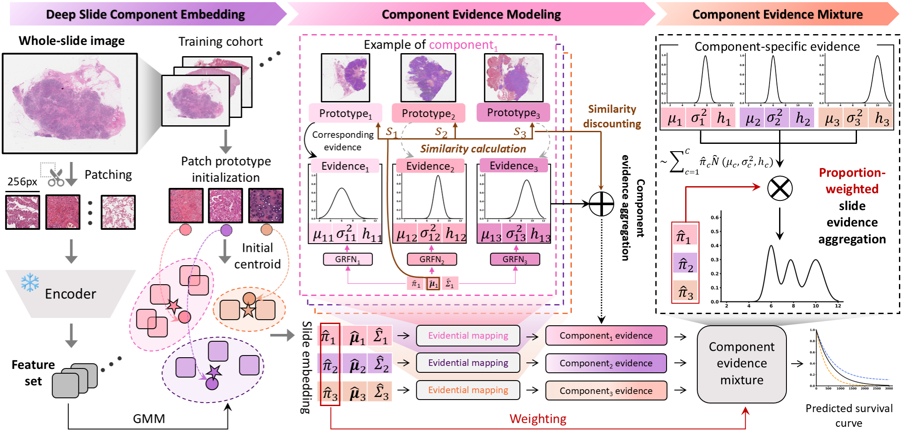
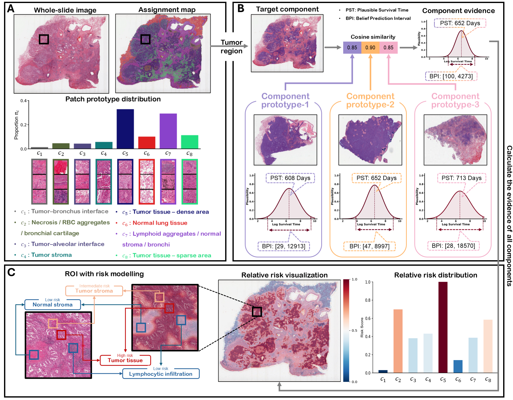

# DPsurv

**Dual-Prototype Evidential Fusion for Uncertainty-Aware and Interpretable Whole Slide Image Survival Prediction**, ICML 2026.
<br><em>Yucheng Xing\*, Ling Huang†, Jingying Ma, Ruping Hong, Jiangdong Qiu, Pei Liu, Kai He, Huazhu Fu, Mengling Feng</em></br>



[Paper](https://proceedings.mlr.press/v306/) | [Cite](#citation)

**Abstract:** Survival prediction from whole slide images (WSIs) is a fundamental task in computational pathology. Existing approaches either discard morphological structure by flattening patch sets, or aggregate prototype representations without accounting for uncertainty in the predictions. We introduce **DPsurv**, a dual-prototype evidential fusion framework that operates on Gaussian Mixture Model (GMM) representations of WSIs. Each morphological prototype is paired with a dedicated evidence neural network expert that outputs heteroscedastic predictions via Generalised Random Fuzzy Numbers (GRFNs), capturing both aleatoric and epistemic uncertainty. Prototype mixture weights directly participate in a mixture-aware discrete survival loss, making training aware of the underlying GMM structure. On five TCGA cancer-type cohorts, DPsurv consistently improves over deterministic baselines in survival discrimination and calibration, while delivering interpretable, prototype-level survival estimates.



## Updates
- **05/2026**: DPsurv codebase is now live.

## Installation

Clone the repository and create the conda environment:

```shell
conda env create -f environment.yml
conda activate dpsurv
```

> **PyTorch / CUDA**: the default `environment.yml` targets CUDA 12.1. Replace `cu121` with `cu118` (or `cpu`) in both the index URL and the torch package name if your driver requires a different version.

## DPsurv Walkthrough

The pipeline has two stages: (1) construct PANTHER GMM slide representations from patch features, and (2) train a DPsurv survival model on those representations.

### Step 0. Data organisation

**Clinical labels**: Place per-fold CSV files under `data/splits/` with the following structure:

```
data/splits/
    TCGA_KIRC_overall_survival_k=0/
        train.csv          # case_id, dss_survival_days, dss_censorship
        test.csv
    ...
    TCGA_KIRC_overall_survival_k=4/
        train.csv
        test.csv
```

Five TCGA cohorts are supported out of the box:

| Dataset | Cancer Type | Approx. Patients |
|---------|-------------|-----------------|
| TCGA-BLCA | Bladder Urothelial Carcinoma | ~390 |
| TCGA-BRCA | Breast Invasive Carcinoma | ~980 |
| TCGA-KIRC | Kidney Renal Clear Cell Carcinoma | ~490 |
| TCGA-LUAD | Lung Adenocarcinoma | ~450 |
| TCGA-UCEC | Uterine Corpus Endometrial Carcinoma | ~480 |

**Patch features**: Extract patch-level features using a foundation model (UNI2, CONCH, etc.) into `.h5` files (one file per slide, shape `[M, D]`). See [CLAM](https://github.com/mahmoodlab/CLAM) for extraction tooling.

### Step 1. Prototype construction (PANTHER GMM)

Use [PANTHER](https://github.com/mahmoodlab/PANTHER) to learn morphological prototypes from training patch features. This produces a `prototypes.pkl` file containing K cluster centroids.

Alternatively, use the bundled extraction script directly:

```shell
python feature_extraction/extract_gmm.py \
    --feat_dir /path/to/feats_h5 \
    --out_path data/splits/TCGA_KIRC_overall_survival_k=0/embeddings/panther.pkl \
    --proto_path /path/to/kirc_prototypes.pkl \
    --in_dim 1536 --n_proto 16 --device cuda
```

This tokenizes each WSI into its PANTHER GMM parameters `(π, μ, Σ)` and saves them as a `.pkl` to `embeddings/` inside the split directory.

### Step 2. Train DPsurv

```shell
# KIRC (default)
bash scripts/run_dpsurv.sh

# Any cancer type
bash scripts/run_dpsurv.sh LUAD
bash scripts/run_dpsurv.sh BRCA

# All 5 datasets in parallel
bash scripts/run_dpsurv.sh BLCA &
bash scripts/run_dpsurv.sh BRCA &
bash scripts/run_dpsurv.sh KIRC &
bash scripts/run_dpsurv.sh LUAD &
bash scripts/run_dpsurv.sh UCEC &
```

Results are written to `results/<DATASET>/`.

**Inner K selection**: within each outer fold, 15% of training data is held out as an inner validation set. K ∈ {1, 2, 3, 4} is selected by early stopping on validation C-index. The full outer-train set is then used to retrain with the selected K.

#### Key hyperparameters (paper defaults)

| Argument | Value | Description |
|---|---|---|
| `--weight` | 0.5 | λ: balance BEL and PL survival terms |
| `--alpha` | 0.5 | Uncensored NLL weight |
| `--lr` | 1e-4 | Learning rate |
| `--k_values` | 1 2 3 4 | K candidates for inner CV |
| `--inner_val_fraction` | 0.15 | Inner validation split fraction |
| `--max_epochs` | 50 | Max training epochs |
| `--patience` | 5 | Early stopping patience |

All defaults are documented in `trainer/train_dpsurv.py --help` and `configs/dpsurv_default.json`.

### Step 3. Baselines

**ABMIL** (raw patch features, no GMM required):

```shell
python trainer/train_mil.py \
    --dataset KIRC --model abmil --input_type raw \
    --feat_dir /path/to/feats_h5 --fold 0 --device cuda
```

**LinearEmb** on GMM embeddings:

```shell
python trainer/train_mil.py \
    --dataset KIRC --model linear_emb --input_type gmm --fold 0
```

### Step 4. Visualization

Prototype assignment maps and GMM mixture weight bar plots can be generated with the accompanying notebook:

```
visualization/prototypical_assignment_map_visualization_LUAD.ipynb
```

Set the four paths in **Cell 0** (`PROTO_PATH`, `SLIDE_PATH`, `FEAT_H5_PATH`, `OUT_DIR`) before running.

## Results

5-fold cross-validation on five TCGA cohorts (mean ± std):

| Dataset | C-index | IBS | NBLL |
|---------|---------|-----|------|
| TCGA-BRCA | 0.688 ± 0.05 | 0.139 ± 0.03 | 0.429 ± 0.07 |
| TCGA-BLCA | 0.655 ± 0.04 | 0.243 ± 0.06 | 0.680 ± 0.16 |
| TCGA-LUAD | 0.633 ± 0.17 | 0.309 ± 0.03 | 0.865 ± 0.11 |
| TCGA-UCEC | 0.728 ± 0.11 | 0.147 ± 0.04 | 0.455 ± 0.09 |
| TCGA-KIRC | 0.732 ± 0.10 | 0.207 ± 0.03 | 0.592 ± 0.07 |
| **Average** | **0.687** | **0.209** | **0.604** |

## Repository Structure

```
DPsurv/
├── feature_extraction/          GMM feature extraction pipeline
│   ├── panther/                 PANTHERBase EM algorithm
│   │   ├── layers.py
│   │   └── networks.py
│   ├── tokenizer.py             PrototypeTokenizer (π, μ, Σ)
│   └── extract_gmm.py           Batch extraction script
├── downstream/                  All downstream survival models
│   ├── dpsurv/                  DPsurv (evidential mixture, GMM input)
│   │   ├── models.py            ENNreg_new, mixture_ENNreg_new
│   │   ├── losses.py            Mixture_Evidential_nll_Loss
│   │   └── data.py              GMMEmbeddingDataset, build_df, collate_flat
│   ├── abmil/                   ABMIL (raw patch input)
│   │   ├── model.py             Gated attention pooling
│   │   ├── dataset.py           PatchBagDataset
│   │   └── losses.py            SurvNLLLoss, evaluate_abmil
│   └── linear_emb/              LinearEmb / IndivMLPEmb (GMM input)
│       ├── model.py
│       └── dataset.py
├── mil_framework/               Unified MIL glue layer
│   ├── factory.py               create_downstream_model()
│   ├── datasets/                WSISurvivalDataset, GMMSurvivalDataset
│   ├── losses/                  NLLSurvLoss, CoxLoss
│   └── utils.py                 EarlyStopping, seed_torch
├── trainer/
│   ├── train_dpsurv.py          DPsurv nested CV (main entry point)
│   └── train_mil.py             Unified MIL training (ABMIL / LinearEmb)
├── examples/
│   └── kirc_dpsurv.ipynb        KIRC DPsurv end-to-end notebook
├── visualization/
│   ├── prototype_visualization_utils.py
│   └── prototypical_assignment_map_visualization_LUAD.ipynb
├── configs/                     Default hyperparameter JSON files
├── data/splits/                 TCGA train/test CSVs (5 datasets × 5 folds)
├── scripts/
│   └── run_dpsurv.sh            Launcher: bash run_dpsurv.sh [CANCER]
├── environment.yml
└── LICENSE.md
```

## Citation

If you find this work useful in your research or if you use parts of this code please cite our paper:

```bibtex
@inproceedings{xing2026dpsurv,
  title     = {DPsurv: Dual-Prototype Evidential Fusion for Uncertainty-Aware and Interpretable Whole Slide Image Survival Prediction},
  author    = {Xing, Yucheng and Huang, Ling and Ma, Jingying and Hong, Ruping and Qiu, Jiangdong and Liu, Pei and He, Kai and Fu, Huazhu and Feng, Mengling},
  booktitle = {Proceedings of the 43rd International Conference on Machine Learning},
  series    = {Proceedings of Machine Learning Research},
  volume    = {306},
  year      = {2026},
  address   = {Seoul, South Korea},
  publisher = {PMLR},
}
```

## Acknowledgements

This work builds on [PANTHER](https://github.com/mahmoodlab/PANTHER) (Song et al., CVPR 2024) for prototype representation learning. We thank the TCGA consortium for providing public cancer genomics data.

## Issues

- Please open new threads or report issues directly to `xingyucheng99@gmail.com`.

## License

This project is licensed under the [Creative Commons Attribution-NonCommercial-ShareAlike 4.0 International License](LICENSE.md).
