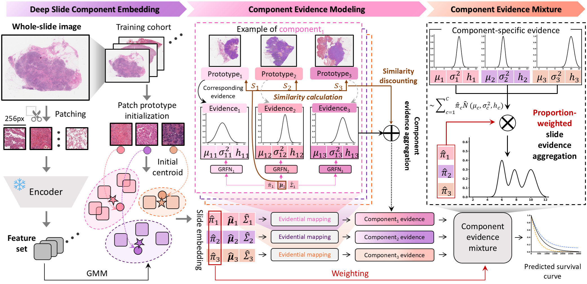
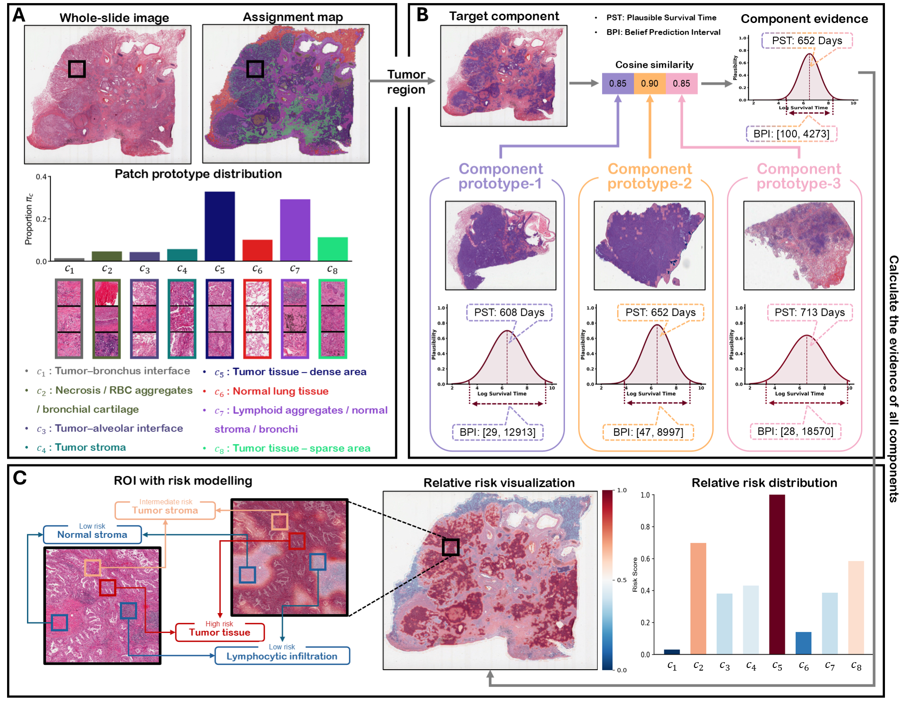

# DPsurv

**Dual-Prototype Evidential Fusion for Uncertainty-Aware and Interpretable Whole Slide Image Survival Prediction**, ICML 2026.
<br><em>Yucheng Xing, Ling Huang†, Jingying Ma, Ruping Hong, Jiangdong Qiu, Pei Liu, Kai He, Huazhu Fu, Mengling Feng</em></br>

[Paper](https://arxiv.org/pdf/2510.00053) · [Cite](#citation)

DPsurv is a dual-prototype evidential fusion framework for survival prediction from whole slide images (WSIs). It operates on Gaussian Mixture Model (GMM) representations: each morphological prototype is paired with an evidence neural network expert that outputs heteroscedastic predictions via Generalised Random Fuzzy Numbers (GRFNs), capturing aleatoric and epistemic uncertainty. On five TCGA cohorts it improves survival discrimination and calibration over deterministic baselines, while giving interpretable, prototype-level survival estimates.



## Installation

```shell
conda env create -f environment.yml   # or: pip install -r requirements.txt (Python 3.9)
conda activate dpsurv
```

> CUDA 12.1 by default. For another driver, swap `cu121` → `cu118`/`cpu` in `environment.yml` (or install `torch==2.5.1` from the matching PyTorch index).

## Reproduce

5-fold splits for BLCA, BRCA, KIRC, LUAD, UCEC are in `data/splits/`; the
endpoint is **disease-specific survival** (`dss_*` columns). The pipeline below
turns patch features into results — run each step per fold (`k=0..4`).

**0. Patch features (external).** Tile each WSI and extract **UNI2** features
(`vit_large`, 20×, 256 px → dim 1536), one `<slide_id>.h5` per slide (key
`features`). See [CLAM](https://github.com/mahmoodlab/CLAM) / [TRIDENT](https://github.com/mahmoodlab/TRIDENT).

**1. Cluster prototypes** (K = 16) from the fold's training features:

```shell
python feature_extraction/cluster_prototypes.py \
    --split_dir data/splits/TCGA_KIRC_overall_survival_k=0 \
    --feat_dir /path/to/tcga_kirc/feats_h5 --in_dim 1536 --n_proto 16
```

**2. Extract GMM embeddings** with PANTHER:

```shell
python feature_extraction/extract_gmm.py \
    --split_dir data/splits/TCGA_KIRC_overall_survival_k=0 \
    --feat_dir /path/to/tcga_kirc/feats_h5 \
    --proto_path data/splits/TCGA_KIRC_overall_survival_k=0/prototypes/prototypes_c16_kmeans_num_1.0e+05.pkl \
    --in_dim 1536 --n_proto 16 --device cuda
```

**3. Train + evaluate** (CV over all 5 folds):

```shell
bash scripts/run_dpsurv.sh KIRC
```

Per-fold metrics and `summary.json` (C-index, C-index_td, IBS, NBLL) are written
to `results/<DATASET>/`. Replace `KIRC` with any cohort; see
`python trainer/train_dpsurv.py --help` for options.

## Visualization

DPsurv overlays prototype-level survival estimates back onto the WSI to show which morphological patterns drive risk.



See [`visualization/prototypical_assignment_map_visualization_LUAD.ipynb`](visualization/prototypical_assignment_map_visualization_LUAD.ipynb) for a worked example.

## Citation

```bibtex
@article{xing2025dpsurv,
  title={DPsurv: Dual-Prototype Evidential Fusion for Uncertainty-Aware and Interpretable Whole-Slide Image Survival Prediction},
  author={Xing, Yucheng and Huang, Ling and Ma, Jingying and Hong, Ruping and Qiu, Jiangdong and Liu, Pei and He, Kai and Fu, Huazhu and Feng, Mengling},
  journal={arXiv preprint arXiv:2510.00053},
  year={2025}
}
```

## Acknowledgements

Built on [PANTHER](https://github.com/mahmoodlab/PANTHER) (Song et al., CVPR 2024) for prototype representation learning. We thank the TCGA consortium for the public data.
